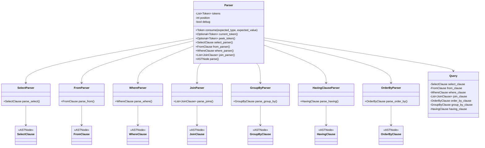

# SQL to Relational Algebra

## Description

This project is a dummy implementation of an Abstract Syntax Tree. The project is currently composed by a Tokenizer which converts keywords into tokens, and an AST parser, which builds a logical map from the SQL query. Finally but not yet implemented, the logical map allows the standardization of queries and the convertion to Relational Algebra.


The purpose of this project is to learn about compilers and AST in general and to apply relational algebra to SQL queries.


Example:

A simple SQL query.

```sql
SELECT name, age FROM users WHERE age > 30 AND city = 'New York';
```

Its abstract form.

```sql
SELECT COLUMN_1, COLUMN_2 FROM TABLE_1 WHERE COLUMN_2 > LITERAL_1 AND COLUMN_3 = LITERAL_2;
```

Its Abstract Syntax Tree representation.

```json
Query(
    select_clause=SelectClause(children=[
        {'node_type': 'SelectItem', 'children': [
            {'node_type': 'Identifier', 'name': 'COLUMN_1'}
        ], 'expression': {'node_type': 'Identifier', 'name': 'COLUMN_1'}},
        {'node_type': 'SelectItem', 'children': [
            {'node_type': 'Identifier', 'name': 'COLUMN_2'}
        ], 'expression': {'node_type': 'Identifier', 'name': 'COLUMN_2'}}
    ]),
    from_clause={'node_type': 'FromClause', 'table': 
        {'node_type': 'Table', 'name': 'TABLE_1'}
    },
    where_clause={'node_type': 'WhereClause', 'conditions': [
        {'node_type': 'Comparison', 'left': 
            {'node_type': 'Identifier', 'name': 'COLUMN_2'}, 
            'operator': {'node_type': 'Operator', 'operator': '>'}, 
            'right': {'node_type': 'Literal', 'value': 'LITERAL_1'}
        },
        {'node_type': 'LogicalOperation', 
            'operator': 'AND',
            'left': {'node_type': 'Comparison', 
                'left': {'node_type': 'Identifier', 'name': 'COLUMN_3'}, 
                'operator': {'node_type': 'Operator', 'operator': '='}, 
                'right': {'node_type': 'Literal', 'value': 'LITERAL_2'}
            }
        }
    ]},
    join_clauses=[],
    group_by_clause=None,
    having_clause=None,
    order_by_clause=None
)
```

## Features

**Tokenization and Token Streaming**
- Token Stream: A parser works with a stream of tokens, which are produced by a lexer (lexical analyzer). Each token represents a syntactic element, like a keyword, identifier, operator, or literal. (PRIMITIVES or DERIVED TYPES)

**Dynamic Typing**
- Tokenizer detects keywords and special words, lexers within parsers analyze the lexical meaning (keyword -> FUNCTION or literal -> STRING mapping)

**Nested Structures**
- Such as logical operators and conditions. These are higher level structures which link several basic nodes. Example provided are multiple conditions on WHERE clause. A logical operation has multiple derived types (comparisons). Each comparison has a left, opertor and right tokens.

```python
LogicalOperation(
    left=Comparison(
        left=Identifier('age'),
        operator=Operator('>'),
        right=Literal(30)
    ),
    operator='AND',
    right=Comparison(
        left=Identifier('city'),
        operator=Operator('='),
        right=Literal('New York')
    )
)
```

**Recursive Descent Parser**
- Consumption: As the parser processes the token stream, it "consumes" tokens to move forward. This means it checks the current token, validates it according to the expected structure (e.g., "SELECT", "FROM", etc.), and then advances to the next token. 
- Position Tracking: Consuming tokens allows the parser to maintain its current position in the token stream. This is crucial for accurately building the AST and for providing meaningful error messages (e.g., pointing out exactly where in the input the error occurred).
- Method Calls: In recursive descent parsers, consuming tokens is often done within methods that represent different grammatical rules (e.g., parse_select(), parse_from()). Each method consumes tokens related to a specific part of the grammar and returns the corresponding AST node.

**Statefulness**
- The parser maintains an internal state as it processes the tokens. Specifically, it keeps track of the current position in the token list (self.position) and updates this position as it consumes tokens. This state (i.e., the current position in the list of tokens) is critical for the parser to correctly understand the structure of the SQL query being parsed.
- The parser remembers which tokens have already been processed and where it is in the sequence of tokens. This memory of past interactions (which tokens have been consumed) is what makes the parser stateful. Without maintaining this state, the parser would not be able to correctly parse complex SQL queries that require understanding the sequence and hierarchy of tokens.




## Limitations

Not yet implemented:

- Subqueries
- CTE's
- Recursive Querying
- Support for all query languages is rather limited
- Window Functions
- Any function which takes more than 1 argument such as CONCAT(), etc
- CASE WHEN